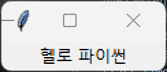

# 모듈 Module
- 함수나 변수 또는 클래스들을 모아놓은 스크립트 파일
    - 표준라이브러리 (파이썬 설치시 제공되는 모듈)
- `import 모듈명1 [,모듈명2,...]`
- `import 모듈명 as 모듈별칭`
- `from 모듈명 import 클래스명/함수명`

> `dir()` 함수 :
모듈이 가진 클래스의 목록을 출력해 준다.

## datetime 모듈
```py
import datetime
datetime.datetime.now()
#>> datetime.datetime(2019,1,2,6,57,27,904565)

today=datetime.date.today()
print(today)
#>> 2019-01-02
today
#>> datetime.date(2019,1,2)

today.year
#>> 2019

today.month
#>> 1

today.day
#>> 2
```

## time 모듈
```py
import time
seconds = time.time()
print(seconds)
#>> epoch 시간, 유닉스시간 (UTC 1970년 1월1일 0시0분0초) 이후 경과 시간 출력
```
```py
import time
time.sleep(1)   # 1초 쉬기
```
```py
# 경과시간 구하기 
import time

start_time = time.time()
print(1+2+3+4+5+6+7+8+9)
end_time = time.time()  #현재
gap = end_time-start_time
print(gap)
```
## math 모듈
```py
import math as m

m.pow(3,3)  # 3의 3제곱

m.fabs(-99) # -99의 실수 절대값

m.ceil(2.1) # 2.1 올림값
m.floor(2.1) # 2.1 내림값

m.log(2.71828) 
m.log(100,10)   # log10애100

m.sin(90.0) # 라디안기준90

m.sin(m.pi/2.0)  # 2분의1파이 == 90도

m.e 

m.radians(90)

m.asin(1.0) # 아크사인

m.degrees(m.asin(1.0))
#>> 90 (도로 나옴)

m.tan(2*m.pi)
```

## random 모듈
- random()  : 0~1 실수 생성
- randrange()   : 지정된 범위내 정수 반환
- randint(a,b) : a<=N<=b 사이의 랜덤정수 N반환
- shuffle(seq)  : 리스트요소를 랜덤하게 섞는다
- choice(seq)   : 시퀀스내의 임의의 요소를 선택
- sample()   : 지정된 개수의 요소를 임의로 선택

```py
import random as rd
rd.random()
rd.randrange(1,7,2) # [1,7) 2배수 반환
rd.randint(1,10)    # [1,10) 정수 반환
```

## turtle 모듈 (그림그리기)
- pass

## sys 모듈
```py
import sys
sys.prefix  # 파이썬 경로
sys.version # 파이썬 버전
sys.copyright # 파이썬 저작권
sys.path # 모듈을 찾을 때 참조하는 경로
```
## tkinter 모듈
- 그래픽 기반의 사용자 인터페이스 프로그램 개발에 유용
###  GUI : 그래픽 사용자 인터페이스
    - 디스플레이에 시각적인 아이콘과 이미지로 정보를 표시하며, 마우스나 터치패드같은 기기를 이용해 사용자가 조작 가능
```py
from tkinter import *  

window = Tk()   
label = Lable(window, text= "헬로 파이썬")
label.pack()

window.mainloop()
```

1. window = Tk()
    - Tk라는 객체를 생성
        - Tk : 화면에 나타나는 윈도 창 객체
            - 최대화버튼, 최소화버튼, 닫기 버튼을 가진 기존적인 윈도 창 객체
2. label = Lable(window, text= "헬로 파이썬")
    - Label이라는 widget위젯으로 윈도에 문자를 넣을 수 있다.
        - 위젯 : 홤녀상에 나타나게될 레이블, 버튼, 텍스트상자, 리스트상자, 메뉴 등 많은 그래픽적 기능을 하는 요소들이 필요한데 이렇게 미리 만들어진 제어가능한 요소들을 말함
        - 레이블 위젯 생성시 첫번째 인자 : 이 레이블이 표시되는 윈도나 캔버스 : parent container
    - window에 뿌려질 문자는 헬로파이썬이다.
3. label.pack()
    - pack()이라는 메소드로 컨테이너에 레이블을 위치 시킨다.
4. window.mainloop()
    - event loop를 생성하는 역할
        - event : 사용자가 마우스를 이동해 버튼이나 체크상자를 클릭하거나 키보에 입력하는 행위
            - 이런 행위 발생시 이를 처리할 수 있도록 프로그램은 항상 대기 상태가 되어야함 (윈도 닫을 때 까지)
                - 이런 연속적인 루프에 들어가도록 하는 메소드 == mainloop()

#### 엔트리를 이용한 사용자 입력 받기
`input_entry = Entry(window,width=50)`