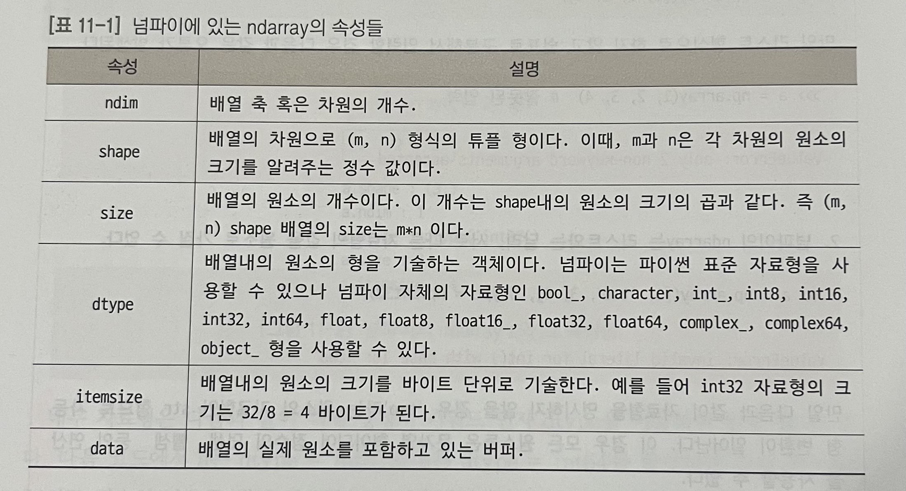

# Numpy 📚

- **설치:** `$pip install numpy`
- **가져오기:** `import numpy as np`
- **설명:** 행렬(다차원 배열 `ndarray`) 뿐만 아니라 여러 수학적 연산에 대한 기능을 제공
```py
a = np.array([1, 2, 3], dtype='int32')
b = np.array([4, 5, 6], dtype=np.int64)
```
- 리스트 형식으로 배열을 만들어야 하며, 내부 자료형은 객체 생성 시 `dtype` 키워드를 이용하여 지정할 수 있습니다. 서로 다른 자료형의 값을 원소로 가질 수 없습니다.



## `ndarray`의 메소드와 주요 함수 🛠️
- `np배열.max()`: 배열의 최대값
- `np배열.min()`: 배열의 최소값
- `np배열.mean()`: 배열의 평균값
- `np배열.flatten()`: 2차원 이상의 배열을 1차원으로 평탄화
- `np.append(배열1, 배열2)`: 두 배열을 합침
- `np.random.rand(3, 3)`: 3x3 배열의 랜덤 실수 생성 (0~1)
- `np.random.randint(0, 10, size=10)`: 0에서 10 사이의 10개의 난수 생성

## `ndarray` 연산 ➕➖✖️➗
- 두 행렬의 덧셈, 뺄셈, 곱셈, 나눗셈은 shape(차원)이 다를 경우 적용되지 않음.
- **행렬곱:** 연산자 `@` 또는 `np.matmul(행렬1, 행렬2)`

## `ndarray` 생성 🔨
- `np.zeros((2, 3))`: 2행 3열의 0으로 초기화된 배열
- `np.ones((2, 3))`: 2행 3열의 1로 초기화된 배열
- `np.full((2, 3), 100)`: 2행 3열의 100으로 초기화된 배열
- `np.eye(n)`: 단위행렬 I

- **`arange()`를 이용한 배열 생성**
    - `np.arange(0, 10, 2)`: `array([0, 2, 4, 6, 8])`

- `np.linspace(0, 10, 5)`: `array([ 0. , 2.5, 5. , 7.5, 10. ])`
    - 지정된 구간에서 동일한 간격의 값을 지정된 횟수만큼 생성

## `ndarray` 재구성 🔄
- `np.기존배열.reshape(2, 5)`: 기존 배열을 다른 차원의 배열로 변환
- `np.transpose(배열)`: 배열의 행과 열을 전치

## 다차원 배열의 축 🌟
- `배열.sum(axis=0)`: 0축 방향(행 방향) 원소의 합
- `np.insert(배열, 1, 2)`: 배열 요소에 새로운 요소를 삽입
    - 인덱싱 1 부분에 2를 삽입
    - `np.insert(배열, 1, 4, axis=0)`: 각 행의 1부분에 4를 추가
    - `np.insert(배열, 1, 4, axis=1)`: 각 열의 1부분에 4를 추가

## 다차원 배열의 인덱싱 📏
- `np.concatenate((a[0, 0], a[0, 2]), axis=0)`: 인덱싱된 데이터를 하나의 `ndarray`로 만듦
    - 매개변수로 `(a[0, 0], a[0, 2])` 같은 튜플과 `axis`를 넣어줍니다.
    - `a[0, 0]`와 `a[0, 2]`를 뽑아 행으로 연결 `[0, 1], [4, 5]` → `[0, 1, 4, 5]`